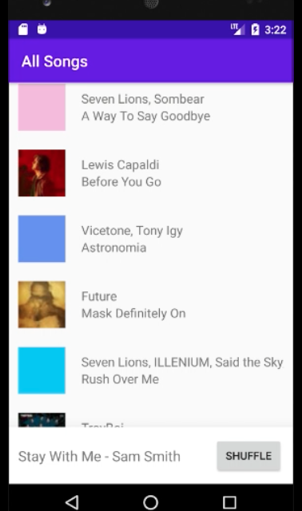
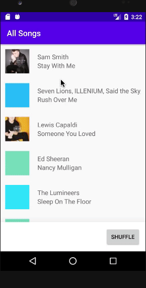

# HW2 - RecyclerView - Dotify - Keith Roberts

This is an iteration hw1's project, which adds on a song list activity to which users can
choose songs to play/delete from that list. This also includes the addition of a shuffle button
that allows songs in the list to be shuffled in their order.

## Extra credit
I have completed extra credit #2 and #3

## Screenshots

## Installation & Usage
Clone the repository and build the gradle project and you're good to go!
