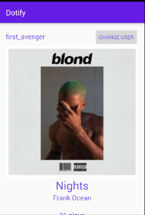

# HW1 - Layouts & Events - Dotify - Keith Roberts

This is a short and simple app created to begin learning how to create layouts and use events on in Android development  using Kotlin.

## Extra credit
I have completed extra credit #1, #2, and #3

## Screenshots

## Installation & Usage
Clone the repository and build the gradle project and you're good to go!
