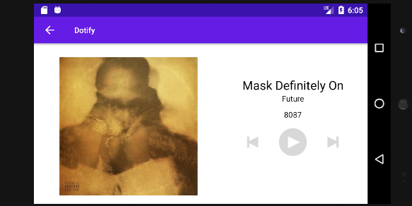

# HW4 - Application, JSON parsing, HTTP REST calls - Dotify - Keith Roberts

In this weeks homework, we utilized Android's application class to hold various data in our application such as the music list and current song via managers.
Along with extracting this logic into the Application, we also set up our app to make actual HTTP REST calls to Github
to retrieve our list of songs displayed in the application, which also required us to set up data models and json parsing
in order to serialize these responses into data that our application can work with.

## Extra credit
I have not completed any extra credit oppurtunities

## Screenshots

## Installation & Usage
Clone the repository and build the gradle project and you're good to go!
