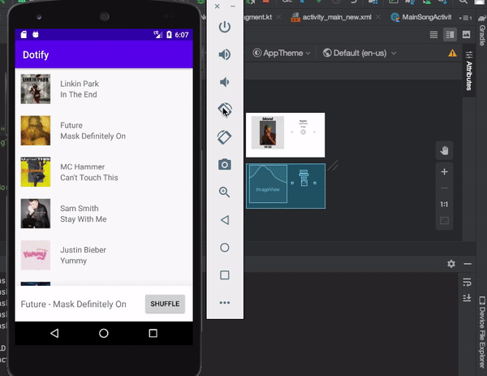

# HW3 - Fragments and Lifecycles - Dotify - Keith Roberts

This is yet another iteration the previous assignment (hw2) in which we did away with
the multi-activity architecture completely in exchange for fragments. This version now
has fragments for the song list and song detail views. Furthermore, landscape support
has been added for layouts in this version.

## Extra credit
I have not completed any extra credit oppurtunities

## Screenshots

## Installation & Usage
Clone the repository and build the gradle project and you're good to go!
